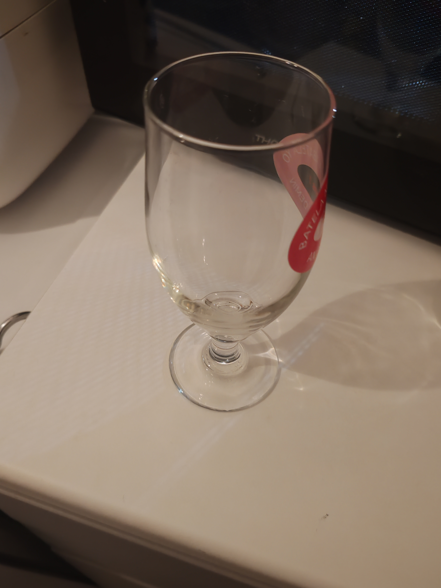
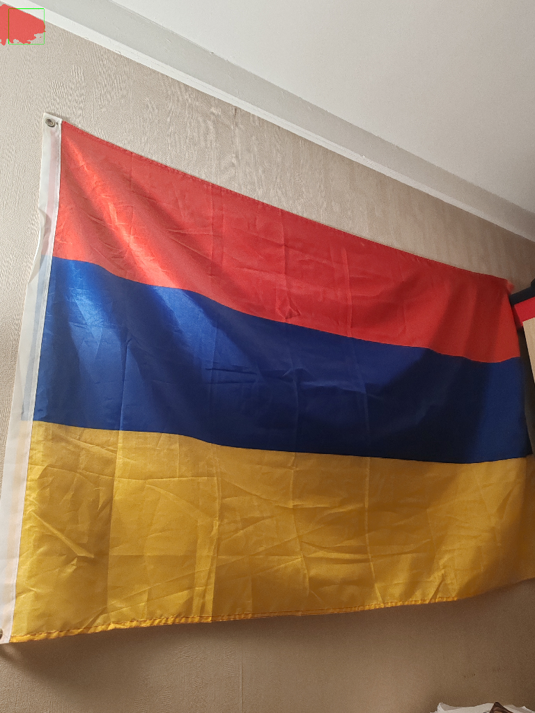

# TP1 — Modern Computer Vision (SAM)

## Dépôt
Lien : https://github.com/alexandreg75/AdvancedConceptsDeepLearning

## Environnement d’exécution
- Exécution : nœud GPU via SLURM (cluster)
- Nœud GPU : arcadia-slurm-node-2
- UI : Streamlit via SSH tunnel

## Environnement conda / CUDA

- Environnement conda activé : `base`
- Vérification PyTorch :
  - torch: 2.9.1+cu128
  - cuda_available: True
  - device_count: 1

## Arborescence (aperçu)
TP1/
- data/images/
- src/
  - app.py
  - sam_utils.py
  - geom_utils.py
  - viz_utils.py
- outputs/
  - overlays/
  - logs/
- report/report.md
- requirements.txt
- README.md

## Dépendances

Installation via `pip install -r TP1/requirements.txt` sur le nœud GPU.

Test d’import :
- `ok`
- `sam_ok`

## UI Streamlit via SSH

- Port choisi : 8521
- Nœud GPU : arcadia-slurm-node-2
- URL locale : http://localhost:8521
- UI accessible via SSH tunnel : oui ✅

### Jeu de données

Le mini-dataset contient 8 images :

- 3 images simples (Image1–Image3) : objet principal bien isolé.
- 3 images chargées (Image4–Image6) : scènes avec plusieurs objets.
- 2 images difficiles (Image7–Image8) : cas avec transparence ou objets fins.

Exemples représentatifs :

- **Image2.jpg** : souris isolée sur fond sombre (cas simple).
- **Image4.jpg** : bureau avec plusieurs écrans et objets (cas chargé).
- **Image7.jpg** : câble fin peu contrasté sur tapis (cas difficile).
- **Image8.jpg** : verre transparent avec reflets (cas difficile).

Premier constat :

Le modèle SAM (vit_b) se charge correctement sur GPU (CUDA disponible). 
L’inférence à partir d’une bounding box retourne un masque binaire de même résolution que l’image ainsi qu’un score cohérent (~0.86). 
Même avec une bbox approximative, le modèle segmente un objet plausible. 
Sur images haute résolution (≈4000x3000), l’inférence reste raisonnablement rapide avec vit_b.

Exercice 4 : 

## Résultats sur 3 images représentatives

| Image | Type | Score | Aire (px) | Périmètre (px) |
|---|---|---:|---:|---:|
| Image2.jpg | Simple | 0.854 | 41046 | 1092.06 |
| Image6.jpg | Chargée | 0.857 | 40132 | 1083.41 |
| Image8.jpg | Difficile | 0.959 | 42923 | 912.88 |

Exercice 5 : 

### Exemple d’overlay (cas difficile)

Analyse :

Les scores sont globalement élevés (>0.85), indiquant que SAM parvient à produire des masques cohérents à partir d’une bounding box simple.

Sur l’image simple (Image2), le masque épouse correctement les contours de l’objet principal.  
Sur la scène chargée (Image6), la segmentation reste stable mais dépend fortement de la précision de la bounding box.  
Sur le cas difficile (Image8), le score est élevé mais l’overlay révèle que certaines zones fines ou ambiguës peuvent être légèrement sur- ou sous-segmentées.

L’overlay (bbox + masque coloré) est particulièrement utile pour diagnostiquer visuellement les erreurs de segmentation : débordement vers l’arrière-plan, trous dans l’objet, ou attraction vers des éléments voisins. Il constitue un outil essentiel pour ajuster les prompts (bounding box) dans une application interactive.

| Image | BBox (x1,y1,x2,y2) | Score | Aire (px) | Périmètre (px) | Temps (ms) |
|---|---|---:|---:|---:|---:|
| Image2.jpg | [0, 604, 3047, 3705] | 1.007 | 6789079 | 11560.70 | 447.34 |
| Image6.jpg | [0, 604, 3047, 4063] | 0.944 | 4269501 | 30314.45 | 445.01 |
| Image8.jpg | [906, 338, 2364, 2845] | 1.004 | 2489655 | 7075.84 | 437.10 |

Quand on agrandit la bbox, SAM dispose de plus de contexte et la segmentation devient plus “globale”, mais elle peut aussi accrocher des éléments voisins (surtout dans une scène chargée), ce qui augmente l’aire et peut déformer le contour. Quand on rétrécit la bbox, la segmentation se focalise davantage sur l’objet visé, mais si la bbox coupe une partie de l’objet, le masque devient tronqué (sous-segmentation). La prévisualisation de la bbox permet d’éviter les erreurs grossières avant inférence, et l’overlay final aide à diagnostiquer rapidement débordements, trous ou attraction vers l’arrière-plan.

### Cas simple — Image2

### Cas difficile — Image6

Exercice 6 : 

Image6 — Scène complexe (cas difficile)
🔹 BBox seule

mask_idx : 0

score : 0.9524

area_px : 7334937

🔹 BBox + FG + BG

mask_idx : 2

score : 0.7526

area_px : 2694871

Observation : l’ajout des points ne permet pas ici d’isoler proprement l’objet souhaité, probablement à cause d’une bounding box trop large et d’un fond complexe.

Image8 — Objet fin (câble)
🔹 BBox seule

mask_idx : 2

score : 0.9305

🔹 BBox + FG (+ BG)

mask_idx : 0

score : 0.9884

Observation : l’ajout d’un point FG (et éventuellement BG) améliore significativement la cohérence du masque et le score.

Analyse globale

L’ajout de points foreground (FG) permet de guider explicitement SAM vers l’objet cible lorsque la bounding box contient plusieurs régions ambiguës. Les points background (BG) deviennent particulièrement utiles lorsque le fond est texturé ou que plusieurs objets sont inclus dans la bbox. Sur des scènes complexes (Image6), même avec des points, la segmentation peut rester instable si la bbox est trop large ou si les frontières sont peu contrastées. En revanche, sur des objets fins ou bien localisés (Image8), les points améliorent nettement la précision et le score du masque. Les cas les plus difficiles restent les objets transparents ou très fins, où la qualité dépend fortement de la précision de la bbox et du placement des points.

7.a — Limites observées et pistes d’amélioration

Les principaux facteurs d’échec observés dans nos tests sont d’abord la bounding box trop large ou mal positionnée, qui inclut plusieurs objets ou une grande portion de fond. Dans ce cas, SAM segmente une région “plausible” mais pas forcément l’objet cible. Ensuite, les objets fins ou peu contrastés (ex : câble, verre transparent) posent problème, car leurs contours sont ambigus et facilement confondus avec l’arrière-plan. Enfin, les scènes complexes avec textures ou occlusions (bureau, lit, objets empilés) rendent la séparation objet/fond instable, même avec des points FG.

Pour améliorer la situation, plusieurs actions concrètes seraient pertinentes :
(1) imposer des contraintes sur la taille minimale et maximale de la bbox,
(2) encourager l’usage de points BG en complément des points FG,
(3) intégrer un post-traitement morphologique léger (filtrage des petites composantes),
(4) adapter le modèle ou fine-tuner SAM sur un dataset plus proche du domaine cible,
(5) proposer une UI plus précise (sélection interactive à la souris plutôt que sliders).

7.b — Logging et monitoring pour une industrialisation

Pour industrialiser cette brique de segmentation, il serait essentiel de monitorer en priorité plusieurs signaux mesurables :

Score moyen des masques (SAM score) : permet de détecter une baisse globale de qualité ou un drift des données.

Temps d’inférence (ms) : utile pour surveiller les performances GPU et détecter une surcharge ou une régression.

Aire du masque (en pixels ou ratio image) : permet d’identifier des segmentations aberrantes (masque couvrant toute l’image ou quasi vide).

Nombre de points FG/BG utilisés : indicateur de difficulté utilisateur ; si beaucoup de points sont nécessaires, l’expérience n’est pas optimale.

Distribution des bbox (taille moyenne, ratio image) : détecte des usages incorrects de l’UI.

Taux de sauvegarde ou validation utilisateur (si intégré dans un workflow métier) : proxy de satisfaction.

Ces métriques permettraient de détecter rapidement des régressions modèles, un drift des données d’entrée, ou des problèmes UX impactant la qualité perçue.
