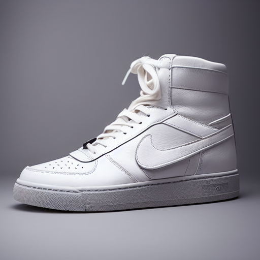
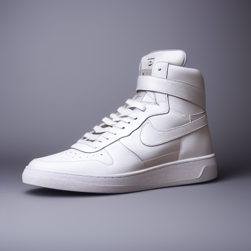
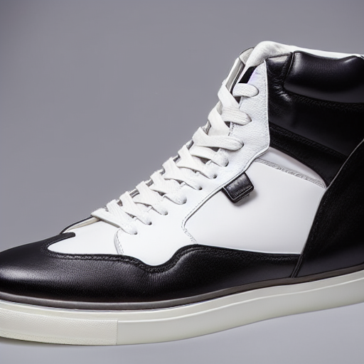
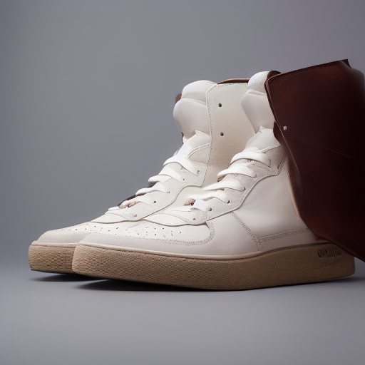
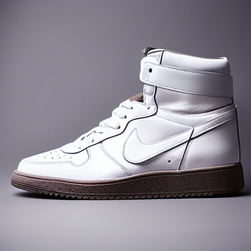
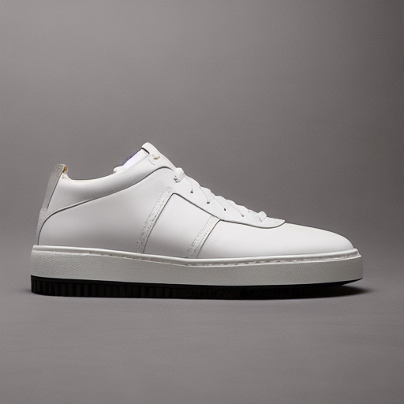
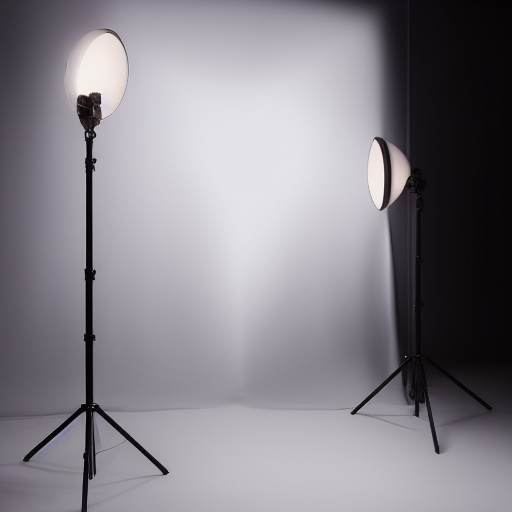
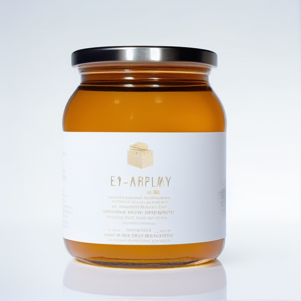

TP2

## Exercice 1 — Smoke test Stable Diffusion v1.5

### Configuration
- Modèle : `stable-diffusion-v1-5/stable-diffusion-v1-5`
- Device : CUDA (GPU)
- dtype : float16
- Seed : 42
- Steps : 25
- Guidance scale : 7.5
- Résolution : 512×512

### Image générée (smoke test)

## Exercice 2 — Baseline text2img

### Configuration
- model_id : stable-diffusion-v1-5/stable-diffusion-v1-5
- scheduler : EulerA
- seed : 42
- steps : 30
- guidance : 7.5
- resolution : 512×512

### Image générée

## Exercice 3 — Text2Img : expériences contrôlées (steps, guidance, scheduler)

**Prompt (constant)** : `ultra-realistic product photo of a premium leather sneaker on a white seamless background, studio lighting, soft shadow, high detail, sharp focus`  
**Negative (constant)** : `text, watermark, logo, low quality, blurry, deformed`  
**Seed (constant)** : `42` — **Resolution** : `512×512`

### Résultats (6 runs)

**Run01 — baseline (EulerA, steps=30, guidance=7.5)**  

**Run02 — steps bas (EulerA, steps=15, guidance=7.5)**  

**Run03 — steps haut (EulerA, steps=50, guidance=7.5)**  

**Run04 — guidance bas (EulerA, steps=30, guidance=4.0)**  

**Run05 — guidance haut (EulerA, steps=30, guidance=12.0)**  

**Run06 — scheduler différent (DDIM, steps=30, guidance=7.5)**  

### Analyse qualitative

- **Steps (15 → 50)** :
  - 15 steps : image déjà cohérente mais légèrement moins détaillée.
  - 50 steps : détails plus fins, textures plus propres, ombres plus naturelles.
  - Gain visible mais non linéaire (diminishing returns).

- **Guidance scale (4.0 → 12.0)** :
  - 4.0 : image plus “libre”, variations plus créatives, parfois moins fidèle au prompt.
  - 7.5 : bon équilibre fidélité / naturel.
  - 12.0 : plus fidèle au prompt mais tendance à sur-accentuer certains détails, rendu parfois plus “rigide”.

- **Scheduler (EulerA vs DDIM)** :
  - EulerA : rendu plus contrasté et parfois plus net.
  - DDIM : rendu légèrement plus doux, parfois plus stable mais un peu moins dynamique.

## Exercice 4 — Img2Img : impact du paramètre `strength`

### Image source (input)

---

### Strength = 0.35

Configuration :
- Scheduler: EulerA
- Seed: 42
- Steps: 30
- Guidance: 7.5
- Strength: 0.35

---

### Strength = 0.60

Configuration :
- Scheduler: EulerA
- Seed: 42
- Steps: 30
- Guidance: 7.5
- Strength: 0.60

---

### Strength = 0.85

Configuration :
- Scheduler: EulerA
- Seed: 42
- Steps: 30
- Guidance: 7.5
- Strength: 0.85

---

### Analyse qualitative

- **Strength = 0.35** :  
  La forme globale du produit est conservée (pot, cadrage, proportions). Les modifications sont légères et portent surtout sur les textures et la netteté. L’image reste très fidèle à l’originale.

- **Strength = 0.60** :  
  L’identité du produit est toujours reconnaissable mais certains éléments évoluent (design de l’étiquette, teintes, détails). On observe un bon compromis entre fidélité et amélioration esthétique.

- **Strength = 0.85** :  
  Le modèle s’éloigne fortement de l’image d’entrée. Le produit reste cohérent visuellement (pot de miel), mais le branding et les détails changent largement. La créativité augmente au détriment de la fidélité.

### Conclusion orientée e-commerce

Pour un usage e-commerce :
- Strength faible (≈0.3–0.5) est adapté pour améliorer légèrement une photo existante.
- Strength moyen permet de générer des variantes marketing.
- Strength élevé est risqué car il peut modifier l’identité réelle du produit (texte généré, branding fictif).

## Exercice 5 — Mini-produit Streamlit (MVP)

### Text2Img

**Configuration :**
- Mode : Text2Img  
- Model : stable-diffusion-v1-5  
- Scheduler : EulerA  
- Seed : 42  
- Steps : 30  
- Guidance (CFG) : 7.5  
- Resolution : 512×512  

---

### Img2Img

**Configuration :**
- Mode : Img2Img  
- Model : stable-diffusion-v1-5  
- Scheduler : EulerA  
- Seed : 42  
- Steps : 30  
- Guidance (CFG) : 7.5  
- Strength : 0.60  
- Resolution : 512×512  

---

### Commentaire

Le mini-produit Streamlit permet de générer des images produit en Text2Img et de transformer une image existante en Img2Img avec contrôle des paramètres clés (seed, steps, guidance, scheduler, strength).  
L’affichage systématique de la configuration garantit la reproductibilité des résultats.

## Exercice 6 — Évaluation light & réflexion

### Grille d’évaluation (0–2 par critère)

- **Prompt adherence** (fidélité au prompt)
- **Visual realism** (réalisme visuel global)
- **Artifacts** (2 = aucun artefact gênant)
- **E-commerce usability** (2 = publiable après retouches mineures)
- **Reproducibility** (2 = paramètres suffisants pour reproduire)

Score total sur 10.

---

## 1️⃣ Text2Img — Baseline (EulerA, steps=30, guidance=7.5, seed=42)

| Critère | Score |
|----------|--------|
| Prompt adherence | 2 |
| Visual realism | 2 |
| Artifacts | 1 |
| E-commerce usability | 2 |
| Reproducibility | 2 |
| **Total** | **9 / 10** |

**Justification :**
- L’image correspond bien au prompt (produit, fond propre, éclairage studio).
- Réalisme élevé, bonne gestion des ombres.
- Légers artefacts sur les textes/étiquettes générés.
- Publishable en contexte e-commerce après retouches mineures.

---

## 2️⃣ Text2Img — Paramètre extrême (ex : guidance=12.0)

| Critère | Score |
|----------|--------|
| Prompt adherence | 2 |
| Visual realism | 1 |
| Artifacts | 1 |
| E-commerce usability | 1 |
| Reproducibility | 2 |
| **Total** | **7 / 10** |

**Justification :**
- Prompt très fortement suivi (image “sur-optimisée”).
- Réalisme légèrement dégradé (contrastes exagérés, rendu artificiel).
- Plus d’artefacts sur les détails fins.
- Moins exploitable directement en e-commerce (aspect trop synthétique).

---

## 3️⃣ Img2Img — Strength élevé (0.85)

| Critère | Score |
|----------|--------|
| Prompt adherence | 2 |
| Visual realism | 1 |
| Artifacts | 1 |
| E-commerce usability | 1 |
| Reproducibility | 2 |
| **Total** | **7 / 10** |

**Justification :**
- L’image suit bien le prompt mais s’éloigne fortement de l’original.
- Perte partielle de fidélité structurelle.
- Texte halluciné sur le produit.
- Risque e-commerce : produit modifié par rapport à la réalité.

---

## Réflexion

L’augmentation du nombre de steps améliore la qualité et la stabilité visuelle, mais augmente la latence et le coût GPU. Au-delà d’un certain seuil (ex : 50 steps), le gain devient marginal par rapport au temps supplémentaire. Le choix du scheduler influence également la netteté et la stabilité, avec des compromis différents entre rapidité et finesse.

La reproductibilité repose principalement sur : le seed, le scheduler, le nombre de steps, la guidance scale, le modèle utilisé et la résolution. Omettre un de ces paramètres peut rendre la reproduction approximative. Les mises à jour de version du modèle ou du scheduler peuvent aussi casser la reproductibilité.

En contexte e-commerce, les principaux risques sont : hallucination de texte/logos, modification involontaire du produit (couleur, forme), génération d’informations trompeuses. Pour limiter ces risques, il faudrait : verrouiller les seeds en production, utiliser img2img à faible strength pour préserver la structure réelle, appliquer des filtres de détection de texte halluciné, et intégrer une validation humaine avant publication.
