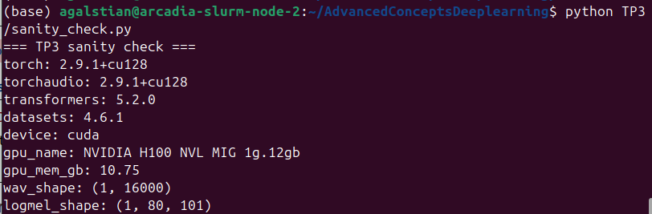
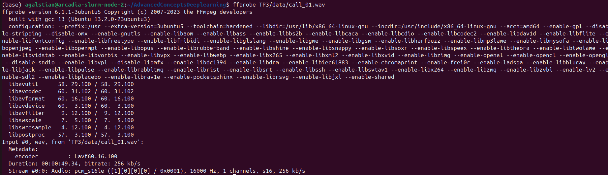
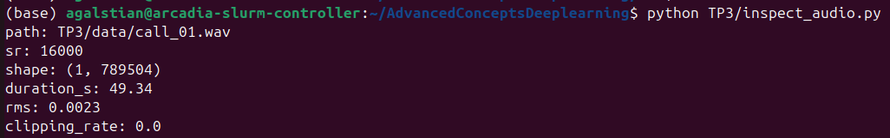
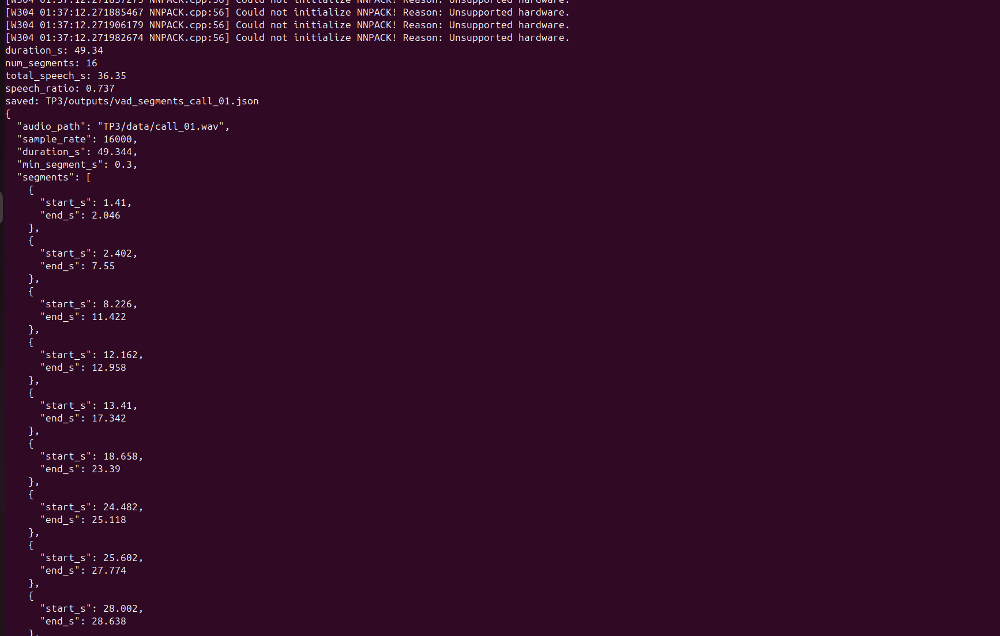
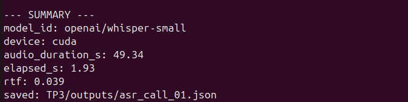
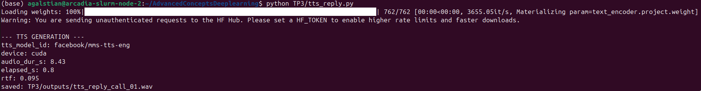
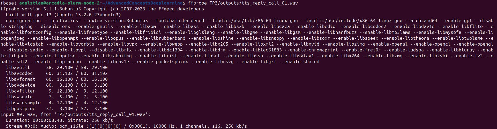
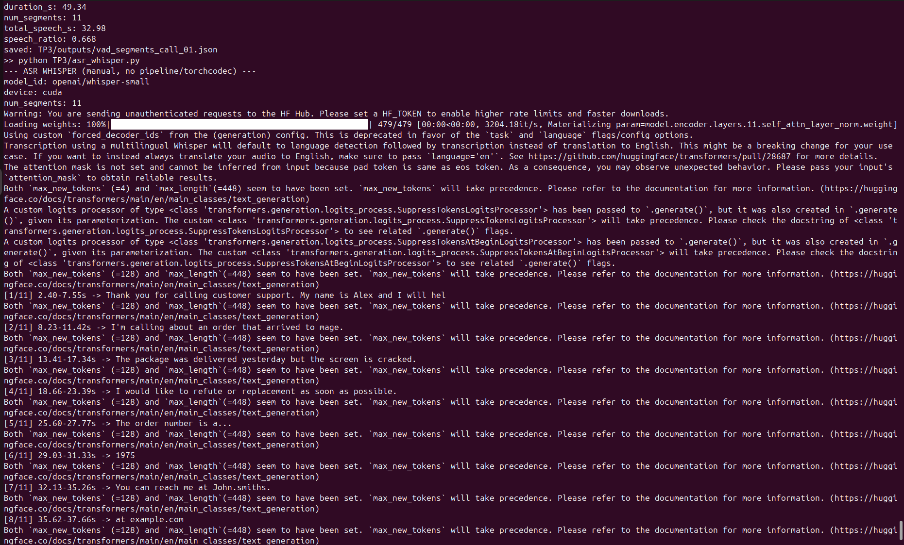
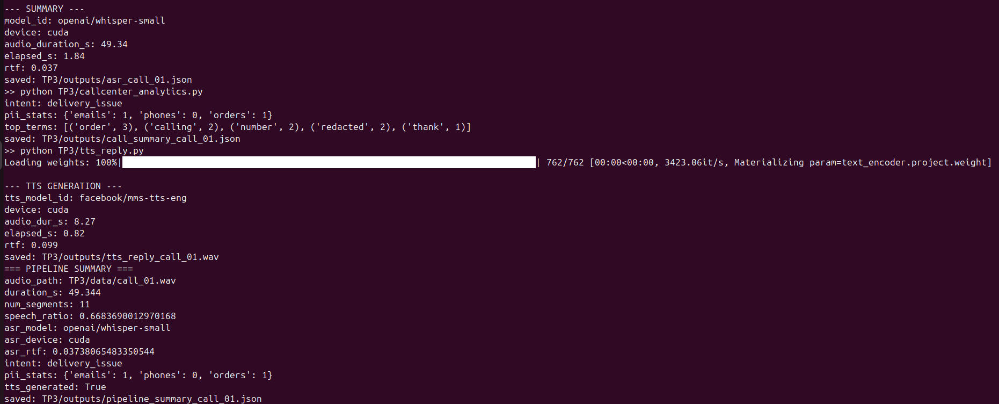
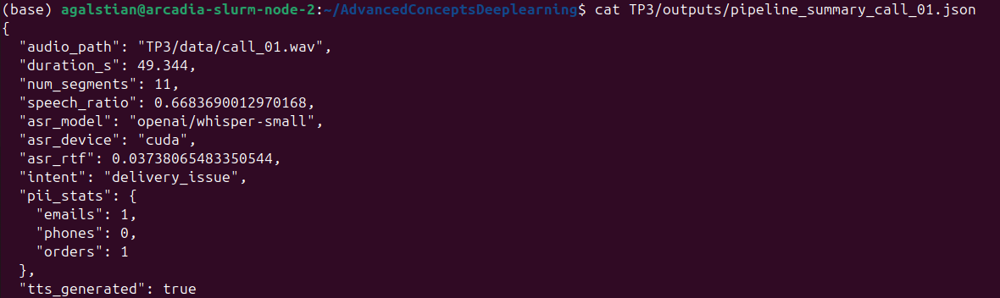

## Exercice 1 — Initialisation et sanity check

### 1.c — Résultat de `sanity_check.py`



```text
=== TP3 sanity check ===
torch: 2.9.1+cu128
torchaudio: 2.9.1+cu128
transformers: 5.2.0
datasets: 4.6.1
device: cuda
gpu_name: NVIDIA H100 NVL MIG 1g.12gb
gpu_mem_gb: 10.75
wav_shape: (1, 16000)
logmel_shape: (1, 80, 101)
```

## Exercice 2 — Vérification audio

### 2.b — Métadonnées du fichier audio



Le fichier audio a été vérifié avec `ffprobe`.  
Les informations importantes sont :

- durée ≈ **49 s**
- format **WAV PCM**
- **mono**
- **16000 Hz**

---

### 2.e — Inspection avec le script `inspect_audio.py`



Sortie du script :

- sample rate : **16000 Hz**
- durée : **49.34 s**
- RMS : **0.0023**
- clipping_rate : **0.0**

Le taux de clipping est nul, ce qui signifie que l'audio ne présente pas de saturation.

### 3.a — Implémentation du VAD

Le script `vad_segment.py` utilise le modèle **Silero VAD** pour détecter automatiquement les segments de parole dans l’enregistrement `call_01.wav`.  
L’audio est d’abord chargé et converti en **mono 16 kHz**, format attendu par le modèle VAD.  
Le modèle analyse ensuite le signal audio et retourne des timestamps correspondant aux portions contenant de la parole.

Ces timestamps sont convertis en secondes afin de produire une liste de segments `(start_s, end_s)`.  
Un filtrage est ensuite appliqué pour supprimer les segments trop courts (`min_dur_s`).  

Enfin, le script calcule plusieurs statistiques :
- la durée totale de l’audio,
- le nombre de segments détectés,
- la durée totale de parole,
- le ratio parole / durée totale.

Les segments et les statistiques sont ensuite sauvegardés dans le fichier JSON  
`TP3/outputs/vad_segments_call_01.json`.

---

### 3.b — Segmentation + statistiques



Résultats obtenus avec `min_dur_s = 0.30` :

- duration_s: **49.34**
- num_segments: **16**
- total_speech_s: **36.35**
- speech_ratio: **0.737**

Extrait (5 segments) du fichier `TP3/outputs/vad_segments_call_01.json` :

```json
[
  {"start_s": 1.41, "end_s": 2.046},
  {"start_s": 2.402, "end_s": 7.55},
  {"start_s": 8.226, "end_s": 11.422},
  {"start_s": 12.162, "end_s": 12.958},
  {"start_s": 13.41, "end_s": 17.342}
]
```

### 3.c — Analyse du ratio parole / silence

Le ratio parole/silence obtenu (**speech_ratio ≈ 0.737**) est cohérent avec une lecture continue du texte.  
La majorité de l’enregistrement correspond à de la parole, tandis que les segments de silence détectés par le VAD correspondent principalement aux pauses naturelles entre phrases, aux respirations ou à de très courts moments sans parole.

---

### 3.d — Effet du filtrage des segments courts

En augmentant le seuil de filtrage (`min_dur_s`) afin de supprimer les segments très courts, les statistiques deviennent :

- duration_s: **49.34**
- num_segments: **11**
- total_speech_s: **32.98**
- speech_ratio: **0.668**

L’augmentation du seuil de durée minimale réduit le nombre de segments détectés, car plusieurs segments courts sont supprimés.  
Cela entraîne également une légère diminution du `speech_ratio`, car certains fragments de parole très courts sont éliminés par le filtrage.

## Exercice 4 — ASR avec Whisper (transcription segmentée + latence)




```text
--- SUMMARY ---
model_id: openai/whisper-small
device: cuda
audio_duration_s: 49.34
elapsed_s: 1.93
rtf: 0.039
saved: TP3/outputs/asr_call_01.json
```
---

Extrait JSON : 

[
  {"segment_id": 0, "start_s": 2.402, "end_s": 7.55, "text": "Thank you for calling customer support. My name is Alex and I will help you today."},
  {"segment_id": 1, "start_s": 8.226, "end_s": 11.422, "text": "I'm calling about an order that arrived to mage."},
  {"segment_id": 2, "start_s": 13.41, "end_s": 17.342, "text": "The package was delivered yesterday but the screen is cracked."},
  {"segment_id": 3, "start_s": 18.658, "end_s": 23.39, "text": "I would like to refute or replacement as soon as possible."},
  {"segment_id": 4, "start_s": 25.602, "end_s": 27.774, "text": "The order number is a..."}
]

Analyse courte :

La segmentation VAD aide globalement la transcription car elle évite que Whisper “hallucine” pendant les silences et réduit le coût de calcul (on ne transcrit que la parole).
En revanche, elle peut gêner sur les informations “découpées” (ex: numéro de commande, email, téléphone) : on observe ici que certains segments isolent des bouts ("555", "0199") et que Whisper perd des caractères (ex: "AX19735" devient partiel, et erreurs comme “arrived to mage”, “refute”).
En production, il faudrait regrouper automatiquement des segments proches (merge si gap faible) ou appliquer un post-traitement dédié aux entités (digits, email).


## Exercice 5 — Call center analytics (PII + intention + fiche appel)

### 5.b — Exécution de `callcenter_analytics.py`

> Capture d’écran du terminal : exécution de `python TP3/callcenter_analytics.py` (intention + pii_stats affichés).
> *(Screenshot : `img/Image6.png`)*

Résultats (après post-traitement pragmatique) :

```text
intent: delivery_issue
pii_stats: {'emails': 1, 'phones': 0, 'orders': 1}
top_terms: [('order', 3), ('calling', 2), ('number', 2), ('redacted', 2), ('thank', 1)]
saved: TP3/outputs/call_summary_call_01.json
```
### 5.c — Extrait de call_summary_call_01.json


intent_scores: {'refund_or_replacement': 2, 'delivery_issue': 7, 'general_support': 5}
intent: delivery_issue
pii_stats: {'emails': 1, 'phones': 0, 'orders': 1}
top_terms[:5]: [['order', 3], ['calling', 2], ['number', 2], ['redacted', 2], ['thank', 1]]

### 5.f — Réflexion (impact des erreurs ASR sur les analytics)


Les erreurs Whisper qui impactent le plus les analytics sont celles qui touchent directement les mots-clés et les PII.
Par exemple, la transcription contient “arrived 2 mage” au lieu de “arrived damaged”, ce qui réduit la détection fiable de l’intention “refund_or_replacement”.
De même, les identifiants épelés (order id) et les emails “parlés” sont difficiles à récupérer sans post-traitement : sans normalisation, une partie des PII peut ne pas matcher les regex et donc rester non masquée.
Enfin, l’absence de ponctuation et les tokens collés perturbent la tokenisation (termes bruités), ce qui peut fausser la liste des top_terms.

## Exercice 6 — TTS léger : générer une réponse “agent” et contrôler latence/qualité

### 6.b — Génération de la réponse vocale



Commande exécutée :

```bash
python TP3/tts_reply.py
```

Résultat obtenu : tts_model_id: facebook/mms-tts-eng
device: cuda
audio_dur_s: 8.43
elapsed_s: 0.8
rtf: 0.095
saved: TP3/outputs/tts_reply_call_01.wav

Le modèle facebook/mms-tts-eng génère une réponse vocale courte à partir du texte fourni dans le script.
La génération est très rapide : avec un RTF ≈ 0.095, la synthèse est environ 10 fois plus rapide que le temps réel.
Cela signifie que ce type de modèle peut être utilisé dans des systèmes interactifs (ex : assistants vocaux ou call centers automatisés).

### 6.c — Vérification des métadonnées du fichier audio



Commande utilisée :

ffprobe TP3/outputs/tts_reply_call_01.wav

Informations importantes extraites :

Duration: 00:00:08.43
Audio: pcm_s16le
16000 Hz
1 channels (mono)
bitrate: 256 kb/s

Le fichier audio généré est un WAV mono 16 kHz, ce qui correspond au format standard utilisé dans les pipelines ASR et TTS.

### 6.d — Observation sur la qualité TTS

La voix générée est globalement claire et intelligible.
La prosodie reste correcte mais légèrement robotique, ce qui est courant pour un modèle TTS léger.
Aucun artefact majeur (coupures ou distorsions) n’est perceptible sur cet extrait court.
Le RTF très faible (≈ 0.095) montre que la génération est nettement plus rapide que la durée audio, ce qui est adapté à des systèmes interactifs temps réel.

### 6.e — Vérification de l’intelligibilité via ASR

Le fichier audio généré est retranscrit avec Whisper afin d’évaluer l’intelligibilité de la synthèse vocale.

Commande exécutée :

python TP3/asr_tts_check.py

Résultat obtenu :

elapsed_s: 1.31
text: Thanks for calling. I am sorry your order arrived. Demaged I can offer a replacement or a refund please confirm your preferred option.

La transcription récupère correctement la majorité du message original.
Une petite erreur apparaît sur le mot “damaged”, transcrit “Demaged”, mais le sens global reste clair.
Cela montre que la synthèse vocale est suffisamment intelligible pour être comprise par un système ASR.


## Exercice 7 — Intégration : pipeline end-to-end + rapport d’ingénierie

### 7.b — Exécution de `run_pipeline.py`





```text
=== PIPELINE SUMMARY ===
audio_path: TP3/data/call_01.wav
duration_s: 49.344
num_segments: 11
speech_ratio: 0.6683690012970168
asr_model: openai/whisper-small
asr_device: cuda
asr_rtf: 0.03738065483350544
intent: delivery_issue
pii_stats: {'emails': 1, 'phones': 0, 'orders': 1}
tts_generated: True
saved: TP3/outputs/pipeline_summary_call_01.json
```

### 7.c — Contenu de TP3/outputs/pipeline_summary_call_01.json
{
  "audio_path": "TP3/data/call_01.wav",
  "duration_s": 49.344,
  "num_segments": 11,
  "speech_ratio": 0.6683690012970168,
  "asr_model": "openai/whisper-small",
  "asr_device": "cuda",
  "asr_rtf": 0.03738065483350544,
  "intent": "delivery_issue",
  "pii_stats": {
    "emails": 1,
    "phones": 0,
    "orders": 1
  },
  "tts_generated": true
}

### 7.d — Engineering note (pipeline end-to-end)

Le goulet d’étranglement principal en temps est l’ASR Whisper, car c’est l’étape la plus “compute-heavy” (inférence seq2seq), même si ici elle reste très rapide sur GPU (asr_rtf ≈ 0.037).
Le VAD et les analytics (regex/heuristiques) sont négligeables en comparaison, et la TTS reste aussi légère (rtf ≈ 0.10 pour ~8.3 s d’audio).
L’étape la plus fragile en qualité est l’ASR : les erreurs de transcription (“arrived to mage”, “refute”) dégradent directement les analytics (intention par mots-clés + PII).
Ensuite, la segmentation VAD peut fragmenter des entités (ex: téléphone en “555” puis “0199”), ce qui complique la détection PII sans post-traitement.
Amélioration 1 : ajouter une fusion automatique des segments VAD proches (merge si gap < 200–300 ms) pour réduire les coupures d’entités et améliorer la cohérence textuelle.
Amélioration 2 : renforcer le post-traitement ASR avant analytics (normalisation digits/épelés, correction “dot/at”, nettoyage ponctuation) + règles de redaction contextuelles (order/email/phone).
Optionnellement, pour industrialiser : mettre en cache les modèles (warmup) et paralléliser la transcription des segments (batching ou file d’attente) pour stabiliser la latence.