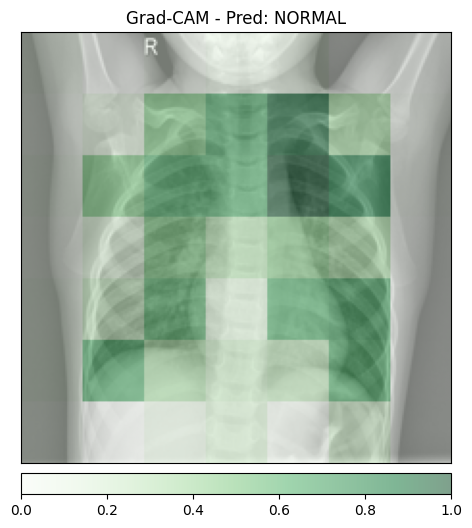
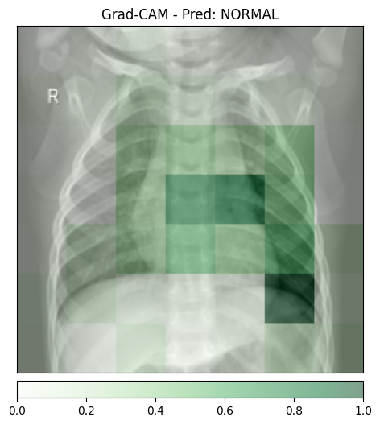
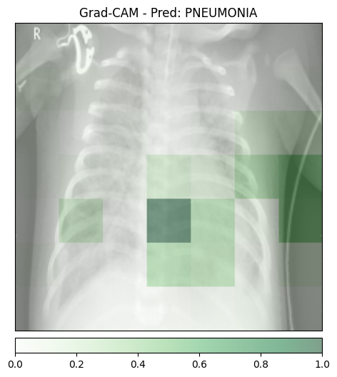
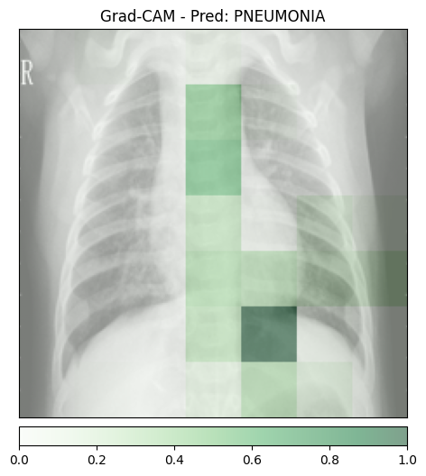
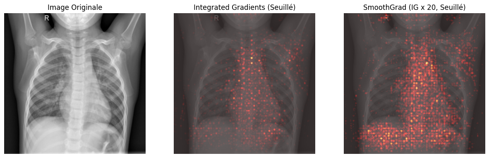
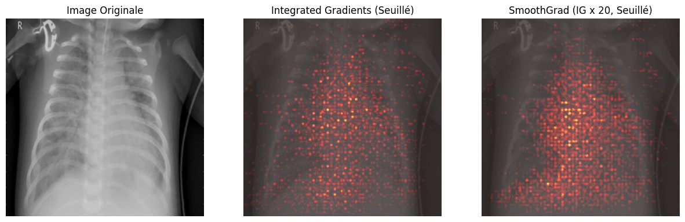
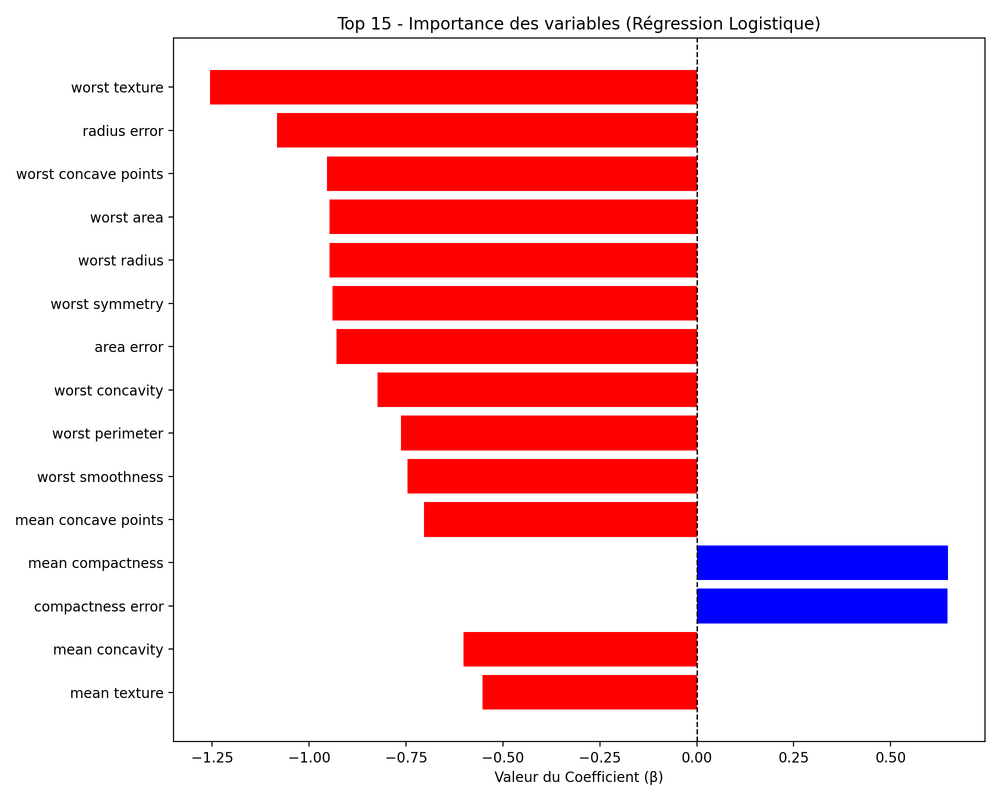
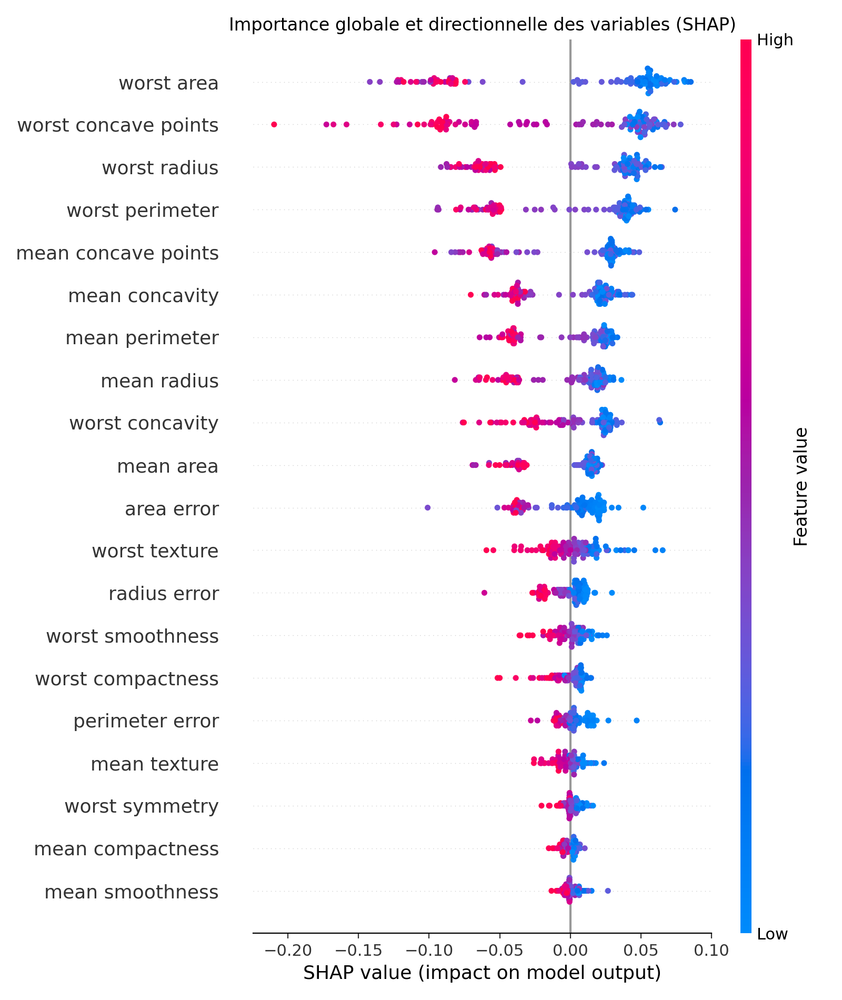
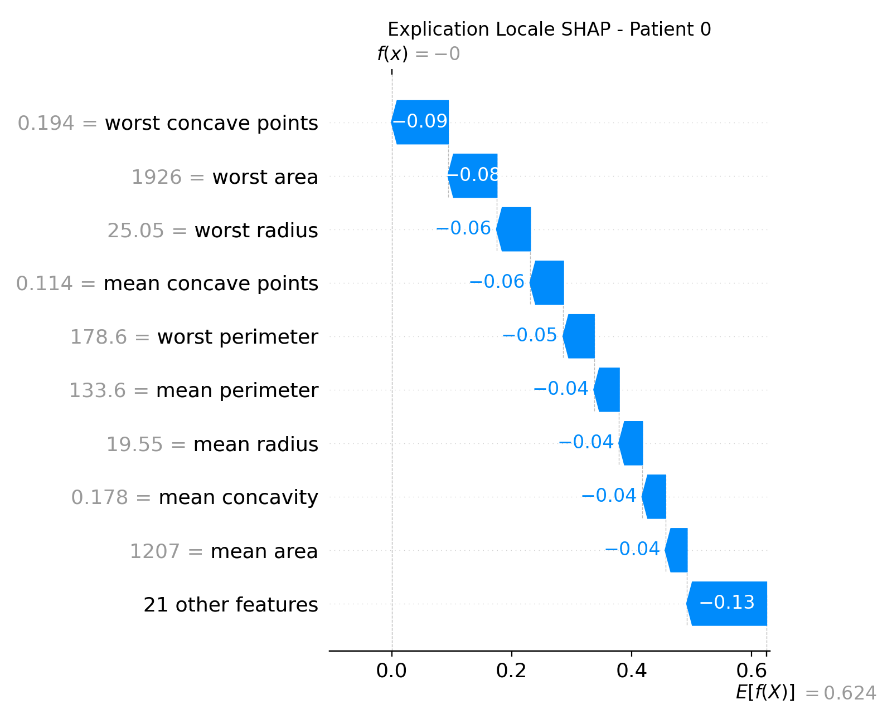

## Exercice 1 — Mise en place, Inférence et Grad-CAM

### 1.a — Setup
Installation des dépendances :
- captum
- transformers
- matplotlib
- Pillow

### 1.b — Images de test téléchargées
Images utilisées :
- normal_1.jpeg
- normal_2.jpeg
- pneumo_1.jpeg
- pneumo_2.jpeg

### 1.c — Script Grad-CAM
Le script `01_gradcam.py` charge une image en argument, lance une inférence ResNet50 et génère une carte Grad-CAM sur la dernière couche convolutive.

### 1.d — Résultats Grad-CAM

#### Grad-CAM sur image saine (normal_1)


#### Grad-CAM sur image saine (normal_2)


#### Grad-CAM sur pneumonie (pneumo_1)


#### Grad-CAM sur pneumonie (pneumo_2)


---

### Analyse — Faux positifs (effet Clever Hans)

Sur certaines images saines, le modèle peut prédire PNEUMONIA.

En observant la carte Grad-CAM sur l’image saine :

Les zones activées sont larges et diffuses.

L’attention n’est pas strictement concentrée sur une anomalie pulmonaire identifiable.

Certaines activations apparaissent sur des structures osseuses ou vers les bords de l’image.

Cela suggère que le modèle ne se base pas uniquement sur des opacités pulmonaires pathologiques, mais potentiellement sur :

- des artefacts de radiographie,

- des variations globales de contraste,

- ou des motifs corrélés au dataset d’entraînement.

Ce comportement correspond à un possible effet Clever Hans :
le modèle exploite des corrélations présentes dans les données plutôt qu’un raisonnement médical robuste.

---

### Analyse — Granularité / Résolution floue
On observe que la carte Grad-CAM :

- est constituée de blocs larges,

- présente une résolution faible,

- ne localise pas précisément les anomalies.

Cette perte de précision vient du fonctionnement du ResNet :

Les couches convolutionnelles successives réduisent progressivement la résolution spatiale.

La dernière couche convolutionnelle possède une carte d’activation de faible dimension.

Grad-CAM s’appuie sur cette dernière couche.

L’attribution est ensuite interpolée vers la taille originale de l’image.

Ainsi, l’explication est sémantique et globale, mais pas précise au niveau du pixel.

Grad-CAM permet donc de comprendre où le modèle regarde, mais pas avec une grande finesse spatiale.

## Exercice 2 — Integrated Gradients et SmoothGrad

### 2.b — Résultats, coûts de calcul et faisabilité temps réel

#### Visualisations (IG vs SmoothGrad)

**Image saine (NORMAL)**  


**Image pneumonie (PNEUMONIA)**  


---

#### Temps d’exécution relevés (CPU)

**normal_1.jpeg**
```text
Temps d'inférence : 0.0615s
Temps IG pur : 4.1577s
Temps SmoothGrad (IG x 20) : 145.5400s
```
**pneumo_1.jpeg**
```text
Temps d'inférence : 0.0600s
Temps IG pur : 5.3207s
Temps SmoothGrad (IG x 20) : 141.7819s
```

Temps réel : possible ou non ?

Non : l’inférence est quasi instantanée (~0.06 s), alors que SmoothGrad prend ~140–145 s sur CPU, donc c’est beaucoup trop long pour générer une explication synchrone lors du premier clic d’un médecin (interaction “temps réel”).

Architecture logicielle proposée (1 phrase)
On fait l’inférence immédiatement, puis on envoie la demande d’explication XAI dans une file de tâches (queue type Celery/RQ + worker GPU/CPU), et le front récupère l’explication plus tard (polling ou WebSocket).

Pourquoi une carte peut descendre sous zéro (avantage vs Grad-CAM/ReLU)

Avec Integrated Gradients, les attributions peuvent être positives ou négatives :

positif = le pixel pousse la prédiction vers la classe (evidence “pour”)

négatif = le pixel pousse la prédiction contre la classe (evidence “contre”)

C’est un avantage par rapport à Grad-CAM qui applique un ReLU et ne garde que le “pour” : on perd alors les informations importantes de type contre-exemple / inhibition, ce qui donne une explication plus complète et plus fidèle.

## Exercice 3 — Modélisation intrinsèquement interprétable (Glass-box)

### 3.c — Régression logistique et interprétation

#### Performance du modèle

Accuracy de la Régression Logistique : **0.9825**

Le modèle obtient une excellente performance tout en restant entièrement interprétable.

---

#### Visualisation des coefficients



Les coefficients négatifs (en rouge) poussent la prédiction vers la classe **Maligne (0)**.  
Les coefficients positifs (en bleu) poussent la prédiction vers la classe **Bénigne (1)**.

---

#### Feature la plus importante vers "Maligne"

La caractéristique ayant le coefficient le plus négatif est :

**worst texture (−1.2551)**

Cela signifie que des valeurs élevées de cette variable augmentent fortement la probabilité que la tumeur soit classée comme **maligne**.

---

#### Avantage d’un modèle intrinsèquement interprétable

Un modèle glass-box fournit une explication directe via ses coefficients, sans nécessiter de méthode d’explication post-hoc approximative, ce qui facilite l’audit et la justification médicale des décisions.

## Exercice 4 — Explicabilité Post-Hoc avec SHAP

### Performance du modèle

Accuracy du Random Forest : **0.9561**

Le Random Forest obtient une excellente performance, légèrement inférieure à la Régression Logistique (0.9825), tout en étant un modèle non-linéaire plus complexe.

---

## Explicabilité Globale (SHAP Summary Plot)



Le Summary Plot montre que les variables les plus importantes sont principalement :

- worst radius  
- worst perimeter  
- worst area  
- worst texture  

Ces variables sont cohérentes avec celles identifiées par la Régression Logistique (notamment *worst texture*).

On peut donc en déduire que ces caractéristiques constituent des **biomarqueurs robustes**, importants indépendamment du type de modèle (linéaire ou non-linéaire).  
Le fait que plusieurs modèles différents identifient les mêmes variables renforce leur crédibilité clinique.

---

## Explicabilité Locale (SHAP Waterfall Plot)



Pour le patient 0, les variables liées à la taille tumorale ont la contribution la plus importante dans la prédiction, notamment :

- worst area = **1926.0**
- worst perimeter = **178.6**
- worst texture = **36.27**

Ces valeurs élevées expliquent une forte influence sur la probabilité finale prédite par le modèle.

Le Waterfall Plot montre comment chaque variable pousse la prédiction à partir d’une probabilité moyenne de base vers la décision finale du modèle.

---

## Conclusion

SHAP permet d’expliquer un modèle complexe (Random Forest) aussi bien :

- au niveau global (importance moyenne des variables),
- qu’au niveau individuel (explication d’un patient précis).

Cela rend une “boîte noire” auditable et exploitable dans un contexte médical critique.